
Parte de aramis:

Según la inteligencia artificial Copilot, esta fue la PC recomendada:

 

Carátula del Trabajo. 
    • Universidad: Universidad Autónoma de Entre Ríos 
    • Facultad: Facultad de Ciencias y Tecnologías 
    • Carrera: Licenciatura en Sistemas de Información 
    • Cátedra: Fundamentos de Computación 
    • Trabajo Práctico: Trabajo Práctico N°1 “Streaming de videojuegos” 
    • Profesores: Bioing. Ismael Cassi ; Lic. Paolo Orundés Cardinali 
    • Integrantes del Grupo: Brunelli Julián; Gutierrez Santos; Valenti Jerónimo, Rebai Aramis 
    • Comisión: 4 
    • Fecha de Entrega: 31 de Octubre 
    • Año Lectivo: 2025 

Y estos son los periféricos recomendados, según esta misma IA:

Según la inteligencia artificial Chat gpt, esta fue la PC recomendada:

Juego elegido: FC 26  

Por lo tanto, según mi criterio, esta fue la pc que elegí, de forma que se adapte a mi presupuesto:

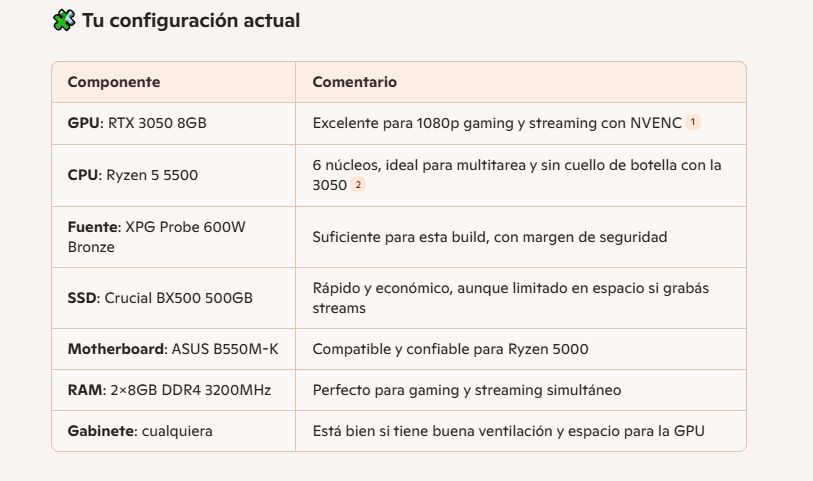

Requeriminetos MÍNIMOS y MÁXIMOS:
  

El presupuesto lo saque de las siguientes páginas: https://ecommerce.paranahardware.com.ar, https://bluetech.com.ar/productos/windows11/ y https://fullh4rd.com.ar/

Esta pagina corresponde a una casa de computacion de Paraná.

El presupuesto total de la pc es de $1,418,127.13, o 998 dolares a precio del 17/9/2025.

El precio de cada componente es el siguiente:
    

 MSI Ventus RTX 3050 8GB OC $ 486,560 

 AMD Ryzen 5 5600X   $289,540.00 

  Adata XPG Probe 600W 80+Bronze     $91,620   

 Patriot Burst Elite SSD 960GB $111,580 
 	

 Asus A620M-K DDR5     $152,770 

Crucial DDR5 16GB 4800Mh   $81,350 

 Sentey M12 ARGB         $55,400  

 A continuación, adjunto los precios sacados de la página:

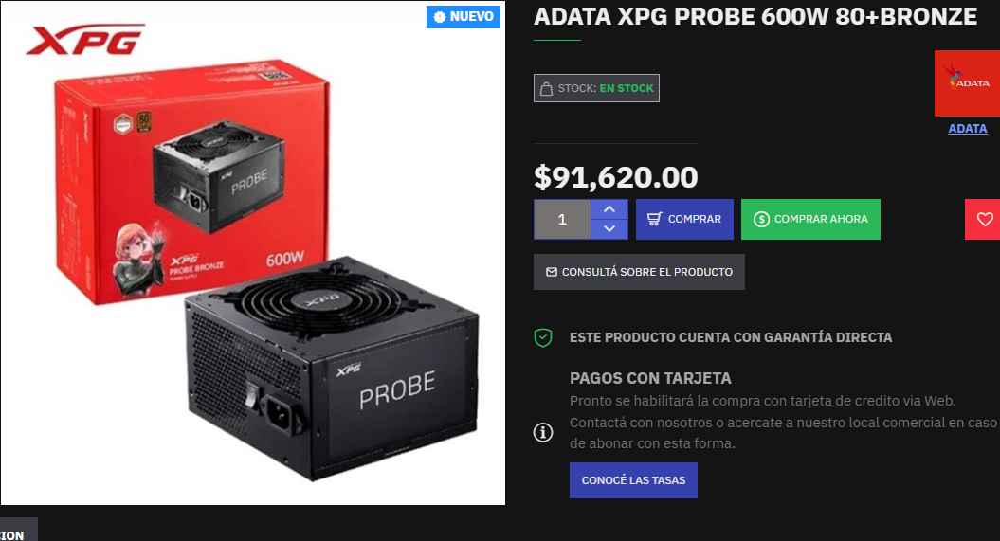
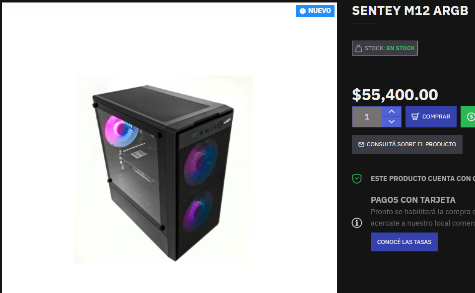
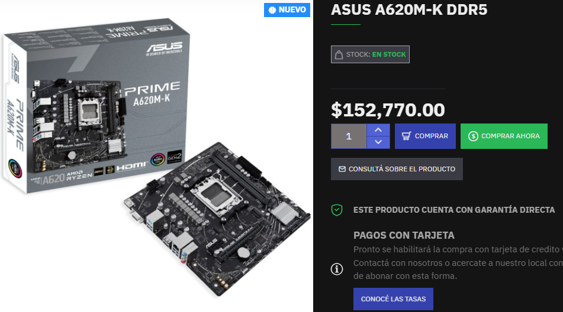
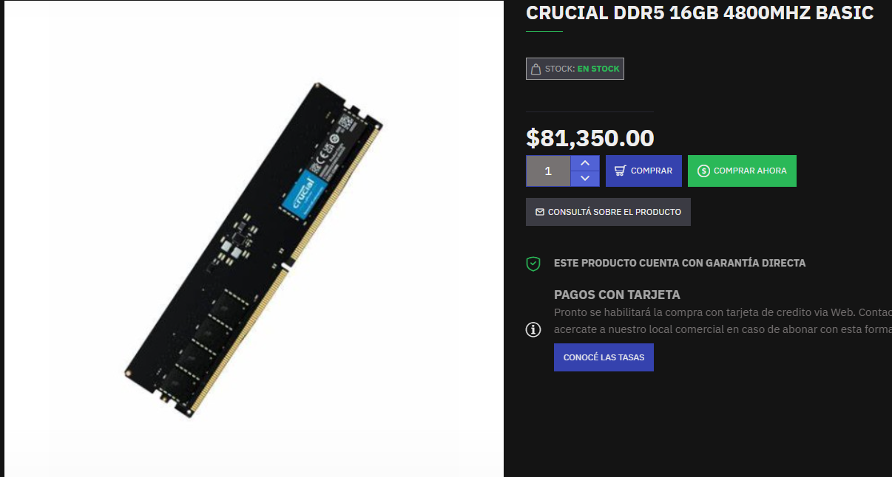
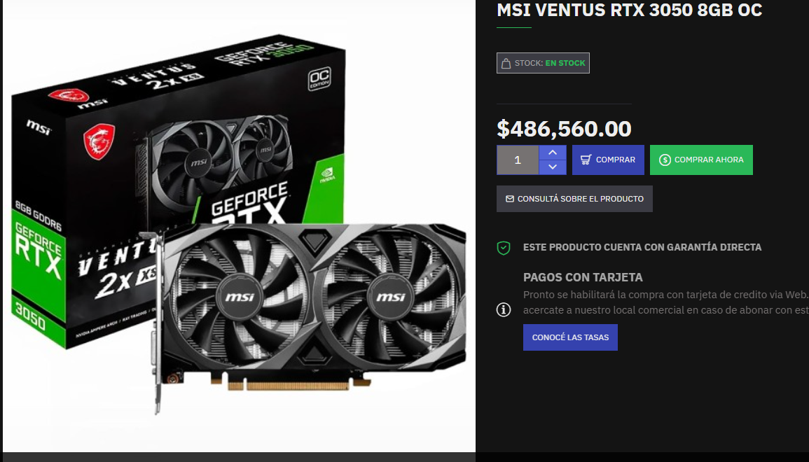

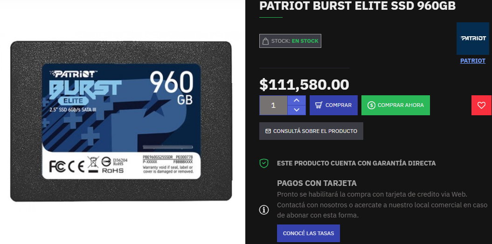

EXPLICACION DE CADA ELECCION:

Placa de video: (MSI Ventus RTX 3050 8GB OC)
Seleccioné esta GPU porque me permite jugar FIFA 26 en 1080p con gráficos altos/ultra. Además, soporta ray tracing y NVENC, lo que ayuda si quiero hacer streaming de mis partidas. Es una opción equilibrada dentro de mi presupuesto. 

Procesador (AMD Ryzen 5 5600X)
Elegí este procesador porque tiene una alta frecuencia y buen rendimiento por núcleo, lo que me permite jugar FIFA 26 con FPS estables y hacer streaming básico sin problemas. 

Ram: (Crucial DDR5 16GB 4800 MHz)
Elegí esta memoria porque es rápida y confiable, ideal para cargar juegos y programas rápidamente. Además, 16 GB me permiten jugar y hacer streaming sin problemas, y puedo ampliarla más adelante si lo necesito, ya que elegi 1 slot y a futuro puedo agregar otra teniendo 32gb en dual chanel.

Almacenamiento: (Patriot Burst Elite SSD 960GB)
Elegí este SSD porque reduce los tiempos de carga de Windows y los juegos, y tiene suficiente espacio para instalar FIFA 26, otros juegos y programas sin preocuparme por quedarme corto de almacenamiento.  

Placa madre: (Asus A620M-K DDR5)
Opté por esta placa porque es compatible con DDR5 y mi Ryzen 5600X, asegurando que la memoria rápida funcione correctamente. Además, me da la posibilidad de actualizar CPU o RAM en el futuro. 

Fuente: (Adata XPG Probe 600W 80+ Bronze)
La fuente la elegí porque entrega energía estable a todos los componentes y tiene certificación 80+ Bronze, lo que protege mi PC y permite un margen para futuras actualizaciones de GPU. 

Gabinete: (Sentey M12 ARGB)
Elegí este gabinete porque tiene buena ventilación, suficiente espacio para mis componentes y un diseño atractivo con luces ARGB. Mantiene todo fresco y organizado..

PERIFERICOS ELEGIDOS:

Lista de precios:

MONITOR 19" DAIHATSU LM1900 HD+ 1440X900 4MS VGA/HDMI $117.870

Sentey GS-5850 Combo Gaming, incluye mouse, auriculares y teclado: $49.000 

WEBCAM LOGITECH C270 HD 960-000694:  $36.538

Total periféricos: $203.408

 A continuación, adjunto los precios sacados de la página:

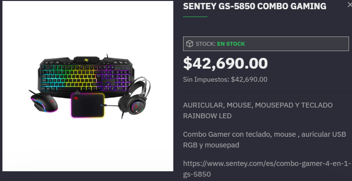
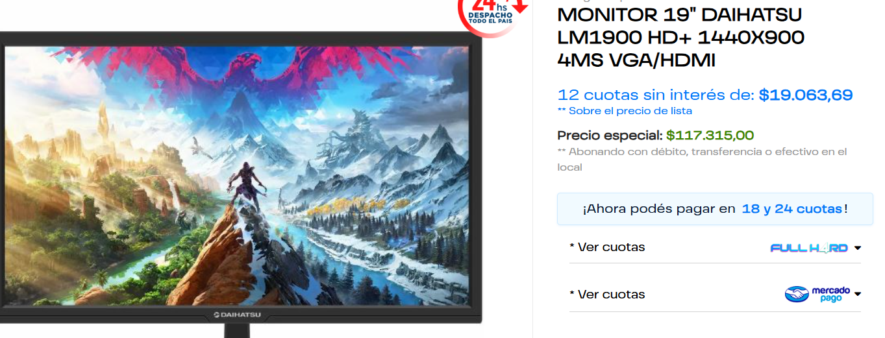
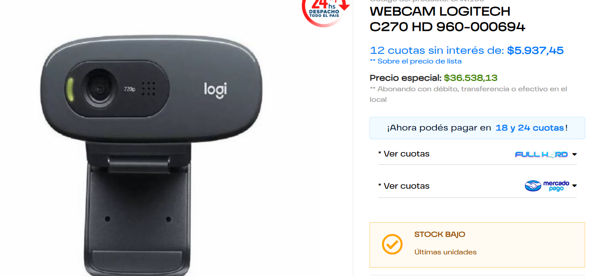

Explicación de cada elección:

Monitor:(Daihatsu LM1900 19” HD+ 1440×900 4ms VGA/HDMI – $117.870)
Elegí este monitor porque tiene una buena resolución (1440×900) y un tiempo de respuesta de 4ms, lo que mejora la experiencia de juego y reduce el desenfoque de movimiento. Además, tiene entradas VGA y HDMI, lo que me permite conectarlo a diferentes dispositivos según lo necesite.

Combo de teclado, mouse y auriculares: Este combo es una opción muy buena para abaratar costos y muy funcional y comodo a la hora de jugar.

Webcam: (Logitech C270 HD 960-000694 – $36.538)
Seleccioné esta webcam porque ofrece resolución HD y enfoque automático rápido, lo que garantiza que mis transmisiones tengan una imagen clara y nítida. Es suficiente para streaming básico.

SISTEMA OPERATIVO:

Elegí comprar esta licencia porque se adaptaba bien a mi presupuesto, y me gusta la interfaz y comodidad de Windows 11. Además, es compatible con todos los programas que necesito para jugar, hacer streaming sin tener complicaciones ya que el sistema operativo es legal y completo 

El precio de esta licencia es de $11.999.

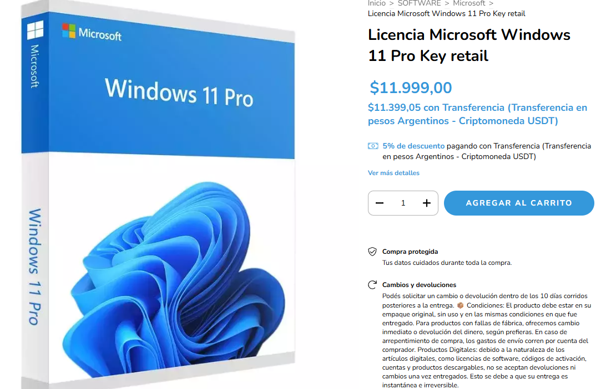

En total, el presupuesto de la pc más los periféricos y el sistema operativo es de $1.453.759, o 988,79 dolares a precio del 17/9/2025.

El presupuesto total se adapta a mi presupuesto inicial, que era de 1000 dolares, y permite tener una PC para jugar y strimear el FC26 en buena calidad y con un buen rendimiento, tambien dandome la libertad que en un futuro puedo mejorar mi pc con componente agregados como por ejempo (ram,ssd,etc).

La opinion de la ia copilot sobre mi pc fue la siguiente:

ALTERNATIVAS DE HARDWARE DESCARTADAS:

Procesador:habia considerar otros procesadores como el Ryzen 7 5800X, el Ryzen 5 5600G. Pero el Ryzen 5 5600X sigue siendo una de las mejores elecciones para gaming y streaming en relación precio-rendimiento. .

Placa de video: Había considerado estas graficasRTX 3060 12GB	GTX 1660 Super	RX 6600 (AMD)	RTX 2060 pero son graficas la cuales algunas son mejores pero su precio es mucho mayo y tienen mucho mas consumo a lo que decidi elegir la RTX 3050 es una tarjeta gráfica moderna, eficiente y versátil, perfecta para jugar y streamear FIFA 2026 en 1080p con calidad alta

Ram: elegi Crucial DDR5 4800MHz ofrece un rendimiento estable, compatible y más que suficiente para gaming y streaming. busque un equilibrio entre rendimiento, precio, confiabilidad y en un futuro ´poder llegar a agregar otra para ponerlas en dual chanel y tener mayor eficiencia y mas ram considere otras ram como corsair, kingstone pero en base a precio y calidad elegi esta.

Almacenamiento: elegi el SSD Patriot Burst Elite 960gb ya que combina velocidad, capacidad sin pagar de más. Es ideal para gaming, streaming y productividad ya que al tener mucho almacenamiento te permite almacenar muchas cosas que a la hora de stremear no te generan problema.

RENDIMIENTOS ESPERADOS:

Con esta configuración, espero poder jugar al FC26 en calidad alta a 1080p con unos FPS estables, de al menos 60 FPS estando stremeando en vivo sin ningun problema de rendimiento. 

Según la ia:

